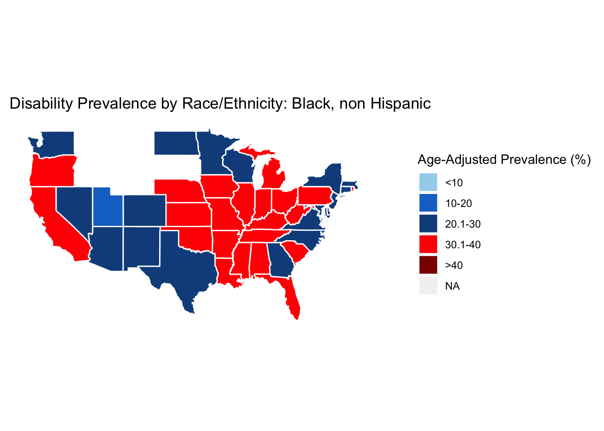
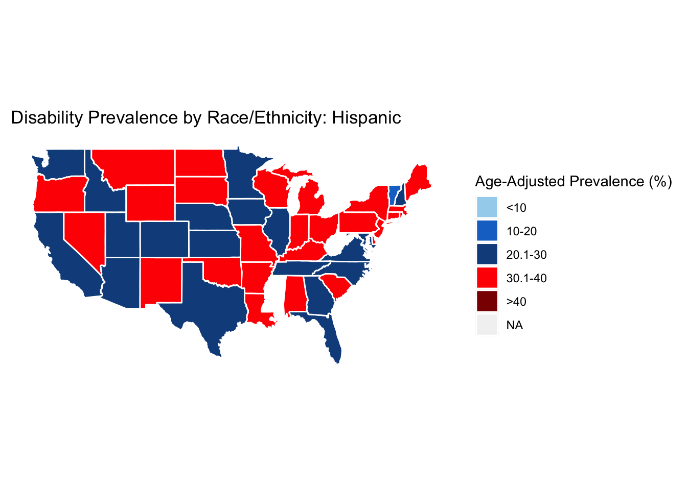
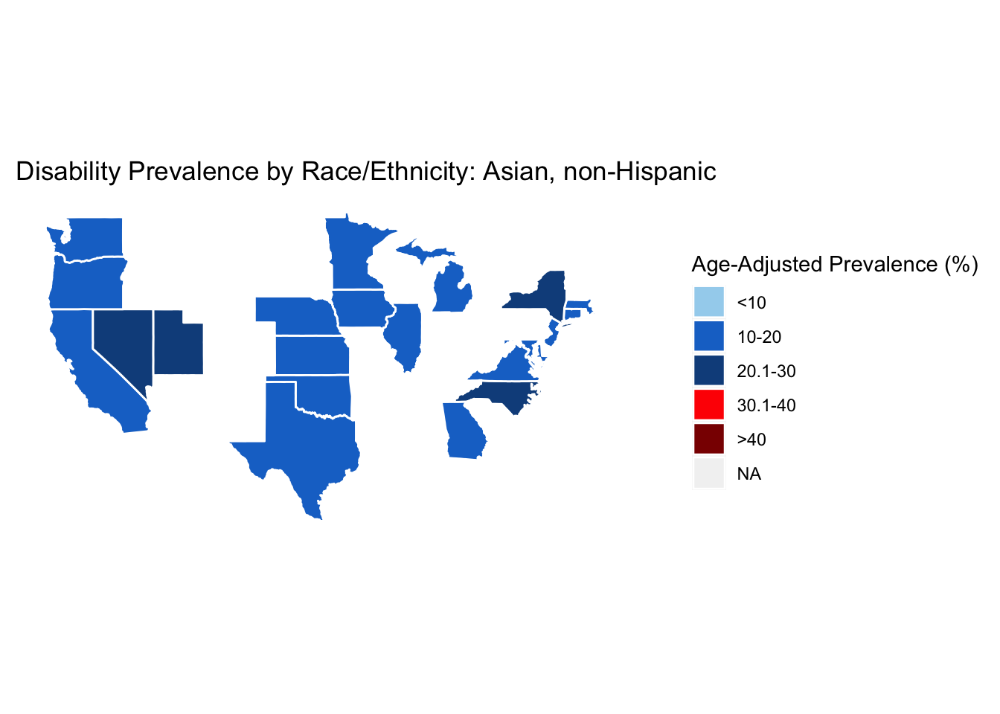
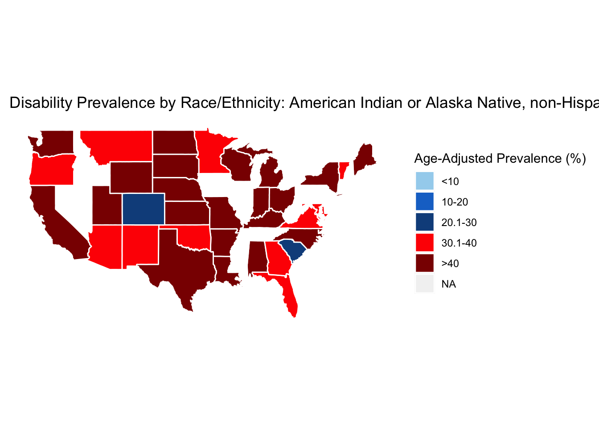
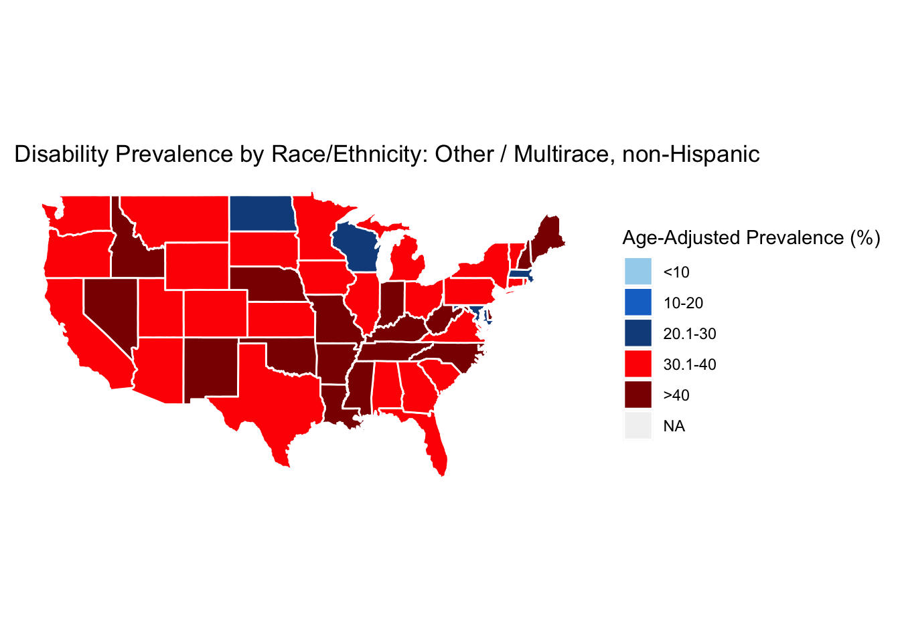
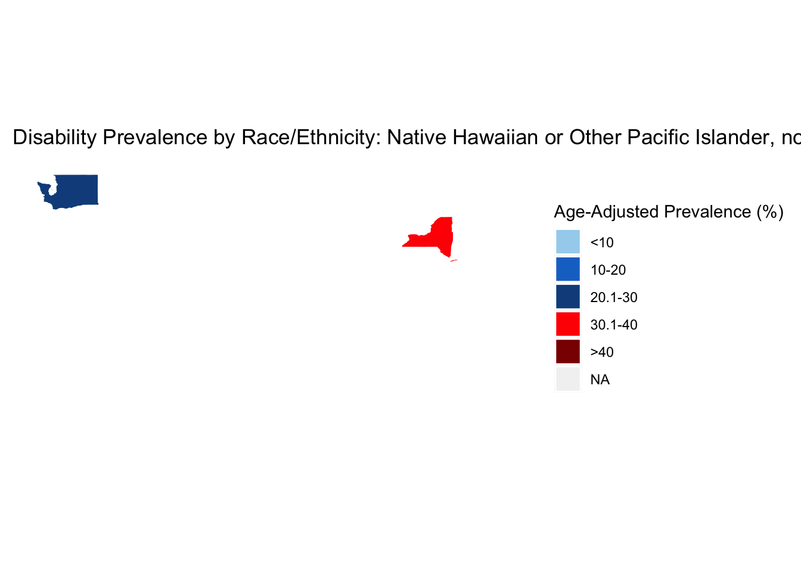
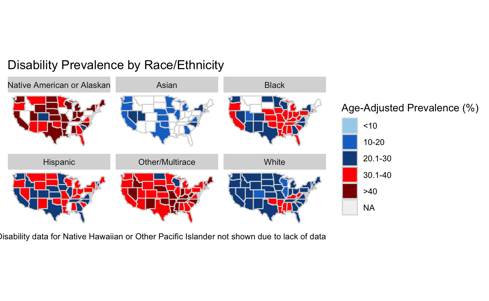

```{r, message=FALSE, warning=FALSE}
library(tidyverse)
library(lubridate)
library(zoo)
library(maps)
library(dplyr)
library(ggplot2)
library(scales)
library(readr)
library(ggthemes)
library(rvest)
library(RColorBrewer)
library(gridExtra)
```

### Overview and Motivation

Motivated by our shared expertise and interests related to social determinants of health, we aim to apply a social and behavioral science lens to explore health disparities in disability status. According to the [CDC](https://www.cdc.gov/ncbddd/disabilityandhealth/infographic-disability-impacts-all.html), one in four American adults has a disability. Globally, the [United Nations](https://www.un.org/disabilities/documents/toolaction/pwdfs.pdf) identified people with disabilities as "the world's largest minority." However, to date, public health research directs limited resources to studying and addressing health disparities within this population. Not only do people with disabilities face challenges with their overall health, but they also experience significant disadvantages with educational and occupational attainment. In order to promote disability inclusion and make sure individuals with disabilities have equal opportunities to participate in and contribute to society, it's important to understand who is most at risk and why. Through our project, we investigate potential correlations between various sociodemographic factors, including race/ethnicity, gender, age, veteran status, and socioeconomic status, and disability status among adults across the U.S. We hope that research in this understudied area will give more public health focus to people with disabilities and identify approaches to target resources towards those with the highest needs.

### Related Work

Researchers from the [Collaborative on Health Reform and Independent Living](https://www.chril.org/) recently released a [report](https://static1.squarespace.com/static/5abe7e9b5ffd206d61d648ef/t/5f80b97ec617441793f29090/1602271616411/CHRIL+Disparities+Report.pdf) among the first of its kind to provide public health advocates and policymakers with existing evidence on individuals with disabilities experience relative social disadvantages compared to those without disabilities. Using data from the 2018 National Health Interview Survey, the authors found that working-age adults with disabilities face systemic disadvantages in every domain of social determinants of health, including economic stability, education, healthcare, neighborhood and built environment, and social/community context. Based on these new findings, we were inspired to further explore the rates of disability in specific minority groups to assess the potential health and social effects  of membership in multiple marginalized groups.

We were also interested in investigating disability-based disparities because two of our team members, Sarah and Kelsey, have recent experience doing research work related to disability. Sarah was inspired by her work with the Division for Youth and Children with Special Needs (DCYSHN) at the Massachusetts Department of Public Health.  She helped DCYSHN evaluate their services for the transition from pediatric to adult health care for youth with special health needs.  Her work there made her want to elevate the experiences and voices of the special health needs community, as it is a community that is often overlooked. Kelsey worked with an organization based in Nova Scotia, Canada, called [Independent Living Nova Scotia (ILNS)](https://ilns.ca/). ILNS is a charity that supports people with disabilities to live independently. Over the summer she worked on a project that aimed to increase uptake of disability benefits in order to further the organization's mission. With that background, we were interested in learning about how socioeconomic factors are associated with disability in the US.

### Initial Questions

In order to explore health disparities within the adult population experiencing disabilities, we performed a series of analyses, providing a comprehensive visualization of the distribution of disability rates and types among different sociodemographic groups. Our analyses included (1) summary statistics, (2) heatmaps, (3) web scraping, and (4) regression analysis, all of which were incorporated into an interactive Shiny App. Each analysis assisted us in exploring a variety of research questions related to social determinants of health salient in the lives of people with disabilities. 

#### *Summary Statistics* 

To gain an initial broad understanding of how social determinants related to disability rates in working-age adults, we explored summary statistics in our primary dataset. This exercise allowed us to answer the following questions: How does prevalence of disability change across different socioeconomic groups? Does this change depending on type of disability?
        
#### *Heatmaps*
        
One analysis we created was a heatmap of the United States showing the prevalence of any disability across sociodemographic factors (e.g. gender, race, age, veteran status). From this analysis, we wanted to see if there was an association between these sociodemographic factors and the prevalence of disabilities. Do older age groups have a higher prevalence of disability compared to younger groups? Do people of color have a higher prevalence of disability compared to white, non-Hispanic populations? Do males or females have a higher prevalence of disability? Do veterans have a higher prevalence of disability compared to non-veterans? All of these questions were things we had hypotheses about, but wanted to visually represent. Over the course of this analysis, our questions evolved from not just what sociodemographic groups have a larger prevalence of having any diability, but also what states and regions in the U.S. had a larger prevalence of disability. Did certain states or regions have a higher prevalence regardless of the sociodemographic factor?
        
#### *Web Scraping* 
        
The questions answered through our web scraping exercise were: What is the employment status of people with disabilities compared to those without in the US? What is the education level of people with disabilities compared to those without in the US? How does the annual income and household income of people with disabilities compare to those without in the US? These questions are important for our project and analysis, because we want to highlight some of the inequities that people with disabilities face in the US, and where policies and programs could target improvements. 
        
#### *Regression Analysis*
        
The goal of the regression analysis was to explore how age intersects with disability. We wanted to investigate whether the prevalence of disabilities changed with age, and if so whether that change was similar for different disabilities. We considered looking at the influence of variables other than age, such as sex and race, but decided to focus on age.  We felt age was interesting because of its connection to different life stages.

### Data 

Our primary source of data was the [Disability and Health Data System (DHDS)](https://www.cdc.gov/ncbddd/disabilityandhealth/dhds/index.html), created by the CDC to provide epidemiologists, researchers, and public health professionals with accessible data on demographics and health outcomes for adults with disabilities. The DHDS obtained and analyzed data from the 2016-2018 Behavioral Risk Factor Surveillance System (BRFSS) reports. We specifically looked at data from 2018. The dataset provides aggregated state-level data for adults with six functional disability types: cognitive, hearing, mobility, vision, self-care, and independent living.

#### *Summary Statistics*

Tge DHDS data was clean to begin with, so the cleanup was very straightforward. We chose to delete out some of the variables to make the dataset more manageable, but that was not necessary for running the analyses. We knew that the data had information on the prevalence of disability in the United States for 2018, and the data was disaggregated by disability type and socioeconomic status (age group, veteran status, race/ethnicity, and sex). We decided to separate the summary plots by socioeconomic status first, so that we could see the trends in prevalence for the different groups. After that, we realized that plotting "Any Disability" and "No Disability" on the same visualization as the individual disability types did not allow us to see the differences across groups very well, and decided to separate that data into different plots. 

#### *Heatmaps*

The DHDS data was aggregated to show state-level prevalence of *any* type of disability by sociodemographic factors, which is what we chose to look at to create our heatmaps.After downloading the data from the CDC's website and uploading the data as a CSV file to R, we cleaned the data by only keeping columns that would be relevant to this analysis. We filtered the data to show only show the aggregated "any disability" rates and also filtered out regions that would not appear on the U.S. heatmap but were present in the data (e.g. Guam, Puerto Rico, Health and Human Service Regions). The state names in the dataset next had to be converted to lowercase before it could be joined with the U.S. map data. Once the cleaned disability file was joined with the U.S. state map data, we made individual color keys for each of the four sociodemographic factors (as the prevalence ranges were very different) and then made the graphs.

#### *Web Scraping* 

In addition to using DHDS data, we also explored relevant socioeconomic status (SES) data from the [American Community Survey (ACS)](https://disabilitystatistics.org/reports/2018/English/HTML/report2018.cfm?fips=2000000&html_year=2018&subButton=Get+HTML#emp-state) from 2018. The data we wanted was formatted in tables on the website, so this required some web scraping. As you can see below, we decided to pull the data from each table that we thought might be relevant to our data analysis. The first two tables were numbers by US states, and then the rest of the tables were overall US numbers. In order to make the data easier to use, we had to do some data reshaping and combining, shown below: 

```{r}
#Source: https://disabilitystatistics.org/reports/2018/English/HTML/report2018.cfm?fips=2000000&html_year=2018&subButton=Get+HTML#emp-state

#Web Scraping Table "Prevalence: Ages 21 - 64"
#Prevalence of disability across states

url <- "https://disabilitystatistics.org/reports/2018/English/HTML/report2018.cfm?fips=2000000&html_year=2018&subButton=Get+HTML#emp-state"

web_scrap <- read_html(url)

tables <- web_scrap %>% html_nodes("table")

table_1 <- tables %>% html_table(fill = TRUE) %>% .[[1]] 

table_1 <- table_1 %>% setNames(c("location_1", "prevalence_1", "location_2", "prevalence_2")) 

table_1 <- table_1 %>% spread(location_1, prevalence_1)
table_1 <- table_1 %>% spread(location_2, prevalence_2)

table_1 <- table_1 %>% gather(location, prevalence) %>% na.omit()

head(table_1)
```


```{r}
#Web Scraping Table "Employment: Ages 21 - 64"
#Employment Rate for people with disabilities across states

table_2 <- tables %>% html_table(fill = TRUE) %>% .[[2]] 

table_2 <- table_2 %>% setNames(c("location_1", "prevalence_with_1", "prevalence_without_1", 
                                  "location_2", "prevalence_with_2", "prevalence_without_2")) %>%
                      select(location_1, prevalence_with_1, location_2, prevalence_with_2)

table_2 <- table_2 %>% spread(location_1, prevalence_with_1)
table_2 <- table_2 %>% spread(location_2, prevalence_with_2)

table_2 <- table_2 %>% gather(location, employment_rate) %>% na.omit()

head(table_2)
```


```{r}
#Table 3
#Web Scraping Table "Employment of non-institutionalized working-age people (ages 21 to 64) by disability status in the United States in 2018"

table_3 <- tables %>% html_table(fill = TRUE) %>% .[[13]] 

table_3 <- table_3 %>% setNames(c("disability_type", "percent_employed", "MOE", 
                                  "number", "MOE_2", "base_pop", "sample_size")) %>%
                      select(disability_type, percent_employed)

#Table 4
# Web scraping table: "Median annual income* of households including any working-age people (ages 21 to 64) by disability status in the United States in 2018"

table_4 <- tables %>% html_table(fill = TRUE) %>% .[[17]] 

table_4 <- table_4 %>% setNames(c("disability_type", "median_hh_income", "MOE", 
                                  "base_pop", "sample_size")) %>%
                      select(disability_type, median_hh_income)

#Table 5
# Web scraping table: "Median annual earnings of non-institutionalized working-age people (ages 21 to 64) who work full-time/full-year by disability status in the United States in 2018"

table_5 <- tables %>% html_table(fill = TRUE) %>% .[[16]] 
table_5 <- table_5 %>% setNames(c("disability_type", "median_earnings", "MOE", 
                                  "base_pop", "sample_size")) %>%
                      select(disability_type, median_earnings)

#Table 6
#Web scraping table: "Percentage of non-institutionalized working-age people (ages 21 to 64) with a Bachelor's degree or more by disability status in the United States in 2018"

table_6 <- tables %>% html_table(fill = TRUE) %>% .[[22]] 
table_6 <- table_6 %>% setNames(c("disability_type", "percent_bachelor", "MOE", "number", "MOE", 
                                  "base_pop", "sample_size")) %>%
                      select(disability_type, percent_bachelor)

#Joining tables
table_join_1 <- full_join(table_3, table_4, by = "disability_type")
table_join_2 <- full_join(table_join_1, table_5, by = "disability_type")
table_final <- full_join(table_join_2, table_6, by = "disability_type")

head(table_final)
```

#### *Regression Analysis* 

The DHDS data was also used for the regression analysis. We removed rows that pertained to Health and Human Services regions and the U.S. overall, because we wanted to focus on state-level data. We also removed rows that were not associated with age groups.  Finally, we removed rows that were not related to the disability being investigated - for my exploratory analysis, we investigated hearing disability. This data wrangling is shown below:

```{r}
# Read in CDC disability data
cdc_readin = read_csv("us_disabilities_2018.csv")

unwanted = c("HHS1", "HHS2", "HHS3", "HHS4", "HHS5", "HHS6", "HHS7", "HHS8", "HHS9", "HHS10", "US")
cdc <- cdc_readin %>% 
  filter(Indicator == "Disability status and types among adults 18 years of age or older by age group") %>%
  filter((LocationAbbr %in% unwanted) == FALSE) %>%
  filter(Stratification1 == "Hearing Disability")
```

### Exploratory Analysis

#### *Summary Statistics*

The CDC dataset prevalence plots are shown below: 

```{r, message=FALSE, warning=FALSE}
#read in csv 
#source: https://data.cdc.gov/Disability-Health/DHDS-Prevalence-of-Disability-Status-and-Types-by-/qjg3-6acf
disability = read_csv("us_disabilities_2018.csv")

disability_2 <- disability %>% select(LocationAbbr, LocationDesc, Response, Data_Value_Type, Data_Value, StratificationCategory1, Stratification1, IndicatorID)

disability_US <- disability_2 %>% filter(LocationAbbr == "US") 

disability_US$Stratification1 <- factor(disability_US$Stratification1, levels = c("No Disability", "Any Disability", "Cognitive Disability", "Hearing Disability", "Mobility Disability", "Vision Disability", "Self-care Disability", "Independent Living Disability"))
```


```{r}
#Disability by Veteran Status

disability_US %>% filter(IndicatorID == "VETIND") %>%
   filter(Stratification1 != "No Disability") %>% 
    filter(Stratification1 != "Any Disability") %>%
  ggplot(aes(Response, Data_Value, fill = Stratification1)) +
  geom_bar(stat = "identity", position = "dodge")+
  coord_cartesian(ylim = c(0, 30)) +
  scale_fill_brewer(palette = "Set1", name = "Disability Type", labels = c("Cognitive", "Hearing", "Mobility", "Vision", "Self-care", "Independent Living")) +
  ggtitle("Prevalence of Disability Type by Veteran Status") +
  theme_clean()+
  xlab("Veteran Status") +
  ylab("Prevalence (%)") 

disability_US %>% filter(IndicatorID == "VETIND") %>%
    filter(Stratification1 %in% c("No Disability", "Any Disability")) %>%
  ggplot(aes(Response, Data_Value, fill = Stratification1)) +
  geom_bar(stat = "identity", position = "dodge")+
  coord_cartesian(ylim = c(0, 100)) +
  scale_fill_brewer(palette = "Set1", name = "Disability Status", labels = c("No Disability", "Any Disability")) +
  ggtitle("Prevalence of Disabilities by Veteran Status") +
  theme_clean()+
  xlab("Veteran Status") +
  ylab("Prevalence (%)")
```


```{r}
#Disability by Age Group 

disability_US %>% filter(IndicatorID == "AGEIND") %>%
  filter(Stratification1 != "No Disability") %>% 
    filter(Stratification1 != "Any Disability") %>%
  ggplot(aes(Response, Data_Value, fill = Stratification1)) +
  geom_bar(stat = "identity", position = "dodge")+
  coord_cartesian(ylim = c(0, 30)) +
  scale_fill_brewer(palette = "Set1", name = "Disability Type", labels = c("Cognitive", "Hearing", "Mobility", "Vision", "Self-care", "Independent Living")) +
    ggtitle("Prevalence of Disability Type by Age Group") +
  theme_clean()+
  xlab("Age Group") +
  ylab("Prevalence (%)") 

disability_US %>% filter(IndicatorID == "AGEIND") %>%
  filter(Stratification1 %in% c("No Disability", "Any Disability")) %>%
  ggplot(aes(Response, Data_Value, fill = Stratification1)) +
  geom_bar(stat = "identity", position = "dodge")+
  coord_cartesian(ylim = c(0, 100)) +
  scale_fill_brewer(palette = "Set1", name = "Disability Status", labels = c("No Disability", "Any Disability")) +
    ggtitle("Prevalence of Disabilities by Age Group") +
  theme_clean()+
  xlab("Age Group") +
  ylab("Prevalence (%)")
```


```{r}
#Disability by Sex

disability_US %>% filter(IndicatorID == "SEXIND") %>%
  filter(Stratification1 != "No Disability") %>% 
    filter(Stratification1 != "Any Disability") %>%
  ggplot(aes(Response, Data_Value, fill = Stratification1)) +
  geom_bar(stat = "identity", position = "dodge")+
  coord_cartesian(ylim = c(0, 30)) +
  scale_fill_brewer(palette = "Set1", name = "Disability Type", labels = c("Cognitive", "Hearing", "Mobility", "Vision", "Self-care", "Independent Living"))+
    ggtitle("Prevalence of Disability Type by Sex") +
  theme_clean()+
  xlab("Sex") +
  ylab("Prevalence (%)")  

disability_US %>% filter(IndicatorID == "SEXIND") %>% filter(Stratification1 %in% c("No Disability", "Any Disability")) %>%
  ggplot(aes(Response, Data_Value, fill = Stratification1)) +
  geom_bar(stat = "identity", position = "dodge")+
  coord_cartesian(ylim = c(0,100)) +
  scale_fill_brewer(palette = "Set1", name = "Disability Status", labels = c("No Disability", "Any Disability")) +
  ggtitle("Prevalence of Disabilities by Sex") +
  theme_clean()+
  xlab("Sex") +
  ylab("Prevalence (%)")
```


```{r, message=FALSE, warning=FALSE}
#Disability by Race/Ethnicity

disability_US %>% filter(IndicatorID == "RACEIND") %>% 
    filter(Stratification1 != "No Disability") %>% 
    filter(Stratification1 != "Any Disability") %>%
  ggplot(aes(Response, Data_Value, fill = Stratification1)) +
  geom_bar(stat = "identity", position = "dodge")+
  coord_cartesian(ylim = c(0, 30)) +
  scale_fill_brewer(palette = "Set1", name = "Disability Type", labels = c("Cognitive", "Hearing", "Mobility", "Vision", "Self-care", "Independent Living")) +
  scale_x_discrete(labels = c("American \nIndian \nor Alaska \nNative", "Native \nHawaiian \nor Other \nPacific \nIslander", "Black", "White", "Asian", "Hispanic", "Other / \nMultirace"))+
  ggtitle("Prevalence of Disability Type by Race/Ethnicity") +
  theme_clean()+
  xlab("Race/Ethnicity") +
  ylab("Prevalence (%)")

disability_US %>% filter(IndicatorID == "RACEIND") %>% filter(Stratification1 %in% c("No Disability", "Any Disability")) %>%
  ggplot(aes(Response, Data_Value, fill = Stratification1)) +
  geom_bar(stat = "identity", position = "dodge")+
  coord_cartesian(ylim = c(0,100)) +
  scale_fill_brewer(palette = "Set1", name = "Disability Status", labels = c("No Disability", "Any Disability")) +
  scale_x_discrete(labels = c("American \nIndian \nor Alaska \nNative", "Native \nHawaiian \nor Other \nPacific \nIslander", "Black", "White", "Asian", "Hispanic", "Other / \nMultirace"))+
  ggtitle("Prevalence of Disabilities by Race/Ethnicity") +
  theme_clean()+
  xlab("Race/Ethnicity") +
  ylab("Prevalence (%)")

```

#### *Heatmaps*

After exploring summary statistics in out data, we visualized our data through individual graphs of each sociodemographic factor on an individual level (i.e. we made a graph for disability for each race/ethnic group) as shown below:

{ width=50% }
{ width=50% } 
{ width=50% }
{ width=50% }
{ width=50% }
{ width=50% }
{ width=50% }
<br />
However, we realized looking at these graphs one by one made it hard to compare differences in disability prevalence between different groups and different states. Because of this, we chose to combine graphs for each sociodemographic characteristic in multi-panel plots. To make it easier to delineate specific states, we also added colored boundary lines. For race, we chose to leave out data for the "Native Hawaiian or Other Pacific Islander" group as there were only two states that provided data for this. As you can see below, having the graphs next to each other makes it much easier to make comparisons and see differences:
 
{ width=50% }

#### *Web Scraping*

The ACS data has information on socioeconomic factors that were not included in the CDC dataset, such as employment status and income by disability status/type. After scraping the tables and looking at the data, we felt that the addition of this data would make our data analysis more robust, and decided to include it in our shiny app. We decided to include plots for median annual income, median household income, employment status, and education level, shown below: 

```{r}
table_final$disability_type <- factor(table_final$disability_type, levels = c("No Disability", "Any Disability", "Visual", "Hearing", "Ambulatory", "Cognitive", "Self-Care", "Independent Living"))
      
#Employment Prevalence

table_final %>%
  ggplot() +
  geom_bar(aes(disability_type, percent_employed), stat = "identity", fill = "dark blue")+
  theme_bw() +
  ggtitle("Percent of people ages 21 to 64 employed \nby disability status in the United States in 2018") +
  xlab("\nDisability Type")+
  ylab("Percent Employed\n")+
  coord_cartesian(ylim = c(0, 100)) +
  scale_x_discrete(labels = c("No Disability", "Any \nDisability", "Visual", "Hearing", "Ambulatory", "Cognitive", "Self-Care", "Independent \nLiving"))
```

```{r}
#Prevalence of Bachelors or Above
 table_final %>%
                ggplot() +
                geom_bar(aes(disability_type, percent_bachelor), stat = "identity", fill = "purple")+
                theme_bw() +
                ggtitle("Percent of People, Ages 21-64, \nwith a Bachelor's Degree or More, \nby Disability Status") +
                xlab("\nDisability Type")+
                ylab("Percent with Degree" )+
                coord_cartesian(ylim = c(0, 100)) +
                scale_x_discrete(labels = c("No Disability", "Any \nDisability", "Visual", "Hearing", 
                                            "Ambulatory", "Cognitive", 
                                            "Self-Care", "Independent \nLiving")) 

```

```{r}
#String Processing - Changing Median Household Income from Character to Numeric 
table_final$median_hh_income <- str_replace_all(table_final$median_hh_income, ",", "")
table_final$median_hh_income <- str_replace_all(table_final$median_hh_income, "\\$", "")
table_final$median_hh_income <- as.numeric(table_final$median_hh_income)

#String Processing - Changing Median Annual Earnings from Character to Numeric 
table_final$median_earnings <- str_replace_all(table_final$median_earnings, ",", "")
table_final$median_earnings <- str_replace_all(table_final$median_earnings, "\\$", "")
table_final$median_earnings <- as.numeric(table_final$median_earnings)

head(table_final)

#Median Household Income
table_final %>%
                ggplot() +
                geom_bar(aes(disability_type, median_hh_income), stat = "identity", fill = "dark green")+
                theme_bw() +
                ggtitle("Median Annual Houshold Income of Households \nIncluding Anyone Ages 21-64, \nby Disability Status") +
                xlab("\nDisability Type")+
                ylab("Median Household Income (in dollars)\n")+
                scale_x_discrete(labels = c("No Disability", "Any \nDisability", "Visual", "Hearing", "Ambulatory", "Cognitive", "Self-Care", "Independent \nLiving")) +
                scale_y_continuous(labels=scales::dollar_format()) +
                coord_cartesian(ylim = c(0, 80000)) 
```

```{r}
#Median Annual Earnings
table_final %>%
                ggplot() +
                geom_bar(aes(disability_type, median_earnings), stat = "identity", fill = "orange")+
                theme_bw() +
                ggtitle("Median Annual Earnings of People, Ages 21-64, \nby Disability Status") +
                xlab("\nDisability Type")+
                ylab("Median Earnings (in dollars)" )+
                scale_x_discrete(labels = c("No Disability", "Any \nDisability", "Visual", "Hearing", 
                                            "Ambulatory", "Cognitive", 
                                            "Self-Care", "Independent \nLiving")) +
                scale_y_continuous(labels=scales::dollar_format()) +
                coord_cartesian(ylim = c(0, 80000)) 
```

#### *Regression Analysis*

We used box plots to visualize the data, which allowed us to see where most of the data was situated for each age group.  We wanted to do a regression analysis to see if there were statistically significant differences between the 18-44 age group and other age groups. We was initially unsure if a linear or logistic regression was more appropriate, and decided on a linear regression because my outcome (prevalence) was continuous. See our box plots and linear regression below:

```{r}
cdc %>%
    ggplot() + 
    xlab("Age Group") +
    ylab("Prevalence") +
    geom_boxplot(aes(Response, Data_Value, group = Response))
```

```{r}
log_reg <- glm(Data_Value ~ Response, data=cdc)
cdc_sum = summary(log_reg)
cdc_sum
```

### Final Analysis 

#### *Summary Statistics* 

In this initial data exploration of the summary statistics, we did not find that our ideas changed very much. Our conclusion was that each of the socioeconomic factors considered in this dataset (age, veteran status, age group, and sex) had an effect on the prevalence of disability, and that it was worthwhile to continue our analysis further with the state data, maps, and regression analysis.

#### *Heatmaps* 

From the heatmap data, we learned that in many states, males have a greater prevalence of disability. Among racial and ethnic groups, Native Americans and Alaskans and Other/Multirace individuals have the highest prevalence of disability, followed by blacks and Hispanics, whites, and then Asians (though there was a lot of missing data from states regarding the prevalence of Asians with disabilities). As individuals age, the prevalence of disability increases. And finally, veterans had a much higher prevalence of disability than non-veterans. 

#### *Web Scraping* 

Our visualizations resulting from our web scraping of SES data indicate that people with disabilities are not able to reach the same level of employment, education, or income, as people without disabilities. While past the scope of this project, future research should explore the barriers to achieving equity in these areas.

#### *Regression Analysis*

From our regression analysis, we learned that the prevalence of disabilities does tend to increase with age in comparison to the 18-44 age group, with the exception of cognitive disabilities. We judged whether there were statistically significant differences in disability rates between age groups by the p-values provided in the linear regression analysis. We deemed all comparisons with a p-value less than 0.05 to be statistically significant. 

```{r}
    cdc_co1 = cdc_sum$coefficients
    Group = c("18-44", "45-64", "65+")
    cdc_co = as.data.frame(cbind(Group, cdc_co1))
    cdc_analysis <- cdc_co %>%
      filter(Group != "18-44")
    names(cdc_analysis)[names(cdc_analysis) == "Pr(>|t|)"] <- "P_Value"
    cdc_analysis <- cdc_analysis %>% mutate(Analysis = cut(as.numeric(P_Value), breaks = c(-Inf, 0.05, Inf), labels = c("There is a statistically significant difference between this age group and the 18-44 age group (p-value < 0.05).", "There is NOT a statistically significant difference between this age group and the 18-44 age group (p-value >= 0.05)."), right = TRUE)) %>%
      select(Group, Analysis)
    cdc_analysis
```


